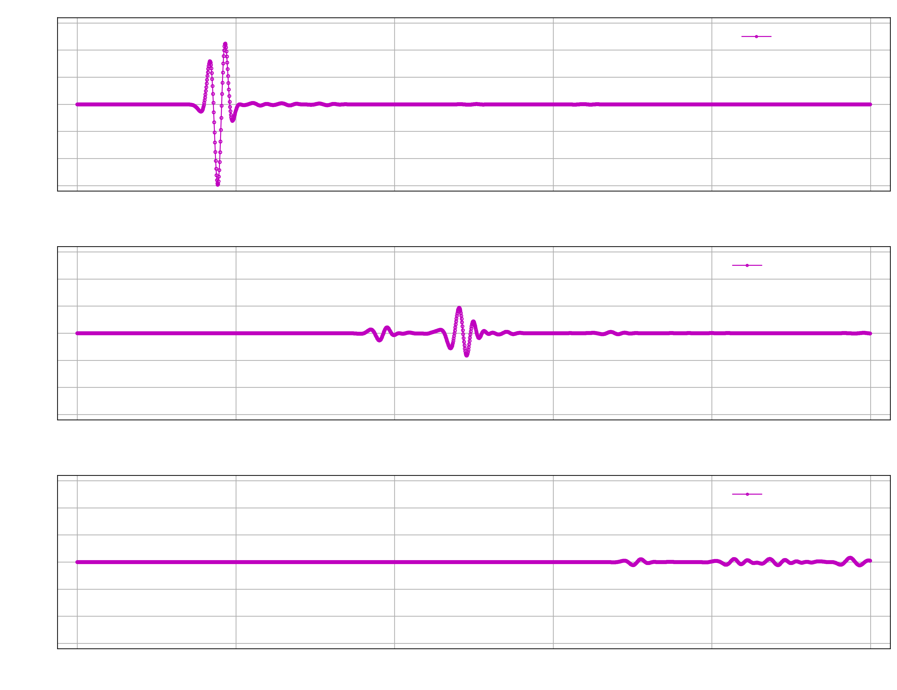
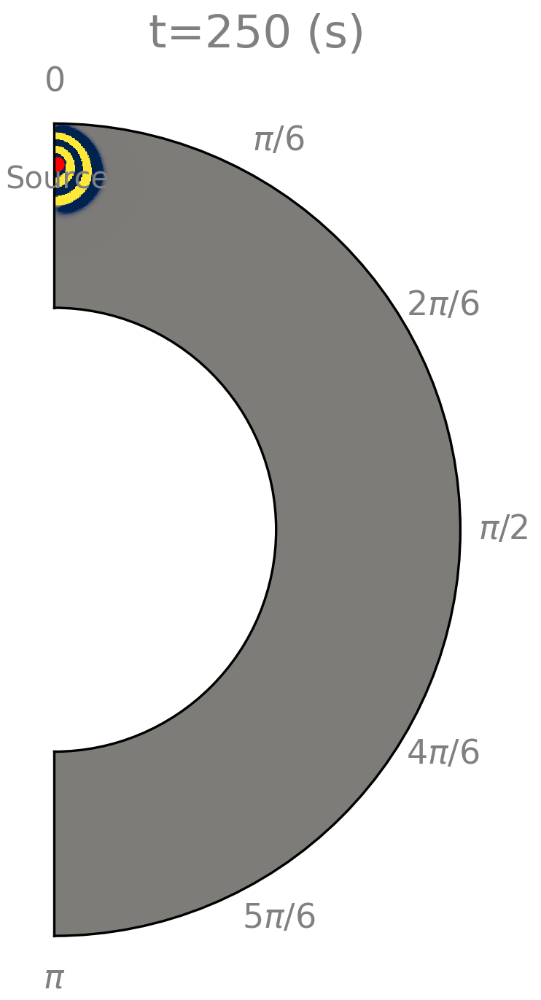
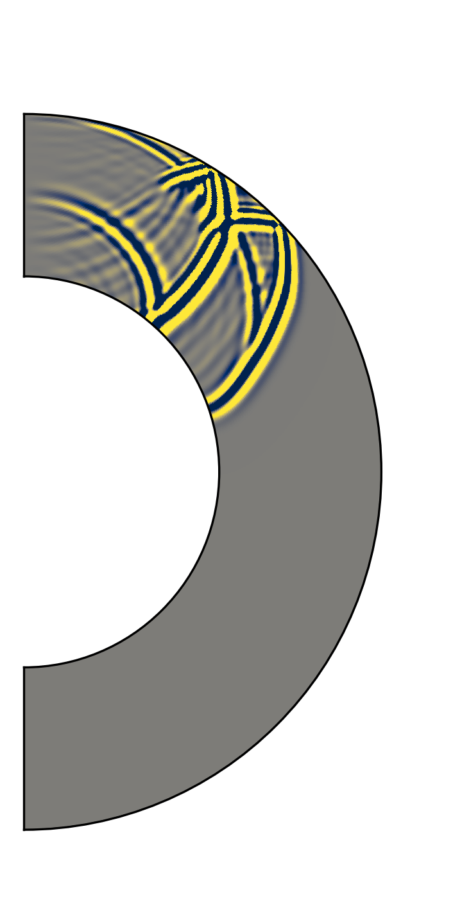
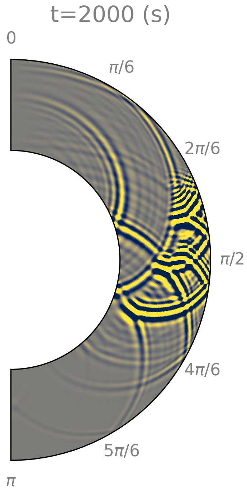

Demo 1
======

.. admonition:: Description:

   Simulates the wave dynamic
   for a single forcing using the PREM Earth's model.

1. Prepare
----------

.. code-block:: bash

   export SHAWDIR=<fullpath-to-the-source-code-repository>
   export EXEDIR=<fullpath-to-where-you-built-the-code-executables>

   # create a dir to run the demo
   export MYRUNDIR=${HOME}/myFirstDemo
   mkdir -p ${MYRUNDIR}

.. Important::
   You need to have the code built to proceed, see :doc:`build_expert` or :doc:`build_stepbystep`.

|

2. Generate the mesh
--------------------

We use a grid of ``200`` x ``1000`` velocity points
along the radial and polar directions, respectively.

To generate the mesh files proceed as follows:

.. code-block:: bash

   cd ${SHAWDIR}/meshing
   python create_single_mesh.py -nr 200 -nth 1000 -working-dir ${MYRUNDIR}

Note that the grid generator script only needs the velocity points
because the stress points are defined automatically
based on the :ref:`staggered scheme <discretization>`.

After generating the grid, you should have a ``${MYRUNDIR}/mesh200x1000`` directory containing:

.. code-block:: bash

   .
   ├── [4.5M]  coeff_vp.dat
   ├── [ 28M]  graph_sp.dat
   ├── [ 16M]  graph_vp.dat
   └── [ 231]  mesh_info.dat

|

3. Input file
-------------

We use the following input file (:doc:`learn more about input file <inputfile>`):

.. literalinclude :: ../../demos/demo1/input.yaml
  :language: yaml

which we have ready for you to copy as:

.. code-block:: bash

   cp ${SHAWDIR}/demos/demo1/input.yaml ${MYRUNDIR}

|

4. Run the simulation
---------------------

.. code-block:: bash

   cd ${MYRUNDIR}

   # soft link the executable
   ln -s ${EXEDIR}/shawExe .

   # if you use OpenMP build, remember to set
   # OMP_NUM_THREADS=how-many-you-want-use OMP_PLACES=threads OMP_PROC_BIND=spread
   ./shawExe input.yaml

|

5. Post-process data
--------------------

The demo should generate inside ``${MYRUNDIR}`` the following:

.. code-block:: bash

   coords_sp.txt #: coordinates of the velocity grid points
   coords_vp.txt #: coordinates of the stresses grid points
   seismogram_0  #: seismogram at the receiver locations set in input.yaml
   snaps_vp_0    #: snapshot matrix for the velocity
   snaps_sp_0    #: snapshot matrix for the stresses

We created Python scripts for this:

.. code-block:: bash

   cp ${SHAWDIR}/demos/demo1/*.py ${MYRUNDIR}

First, the seismogram data:

.. code-block:: bash

   cd ${MYRUNDIR}
   python plotSeismogram.py

Then, contour plots of the velocity field at ``t=250, 1000, 2000`` (seconds):

.. code-block:: bash

   cd ${MYRUNDIR}
   ln -s ${EXEDIR}/extractStateFromSnaps .

   # extract from the velocity snapshots the velocity field at specific timesteps:
   # since we use ``dt = 0.25`` seconds, our tartgets ``t=250, 1000, 2000``,
   # correspond to *time steps* 1000, 4000, 8000
   ./extractStateFromSnaps --snaps=./snaps_vp_0 binary --fsize=1 \
     --outformat=ascii --timesteps=1000 4000 8000 \
     --samplingfreq=100 --outfileappend=vp

   python plotWavefield.py

