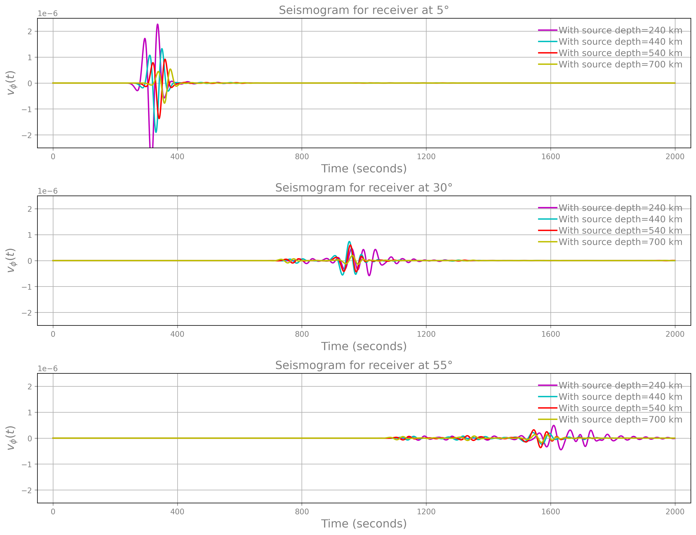
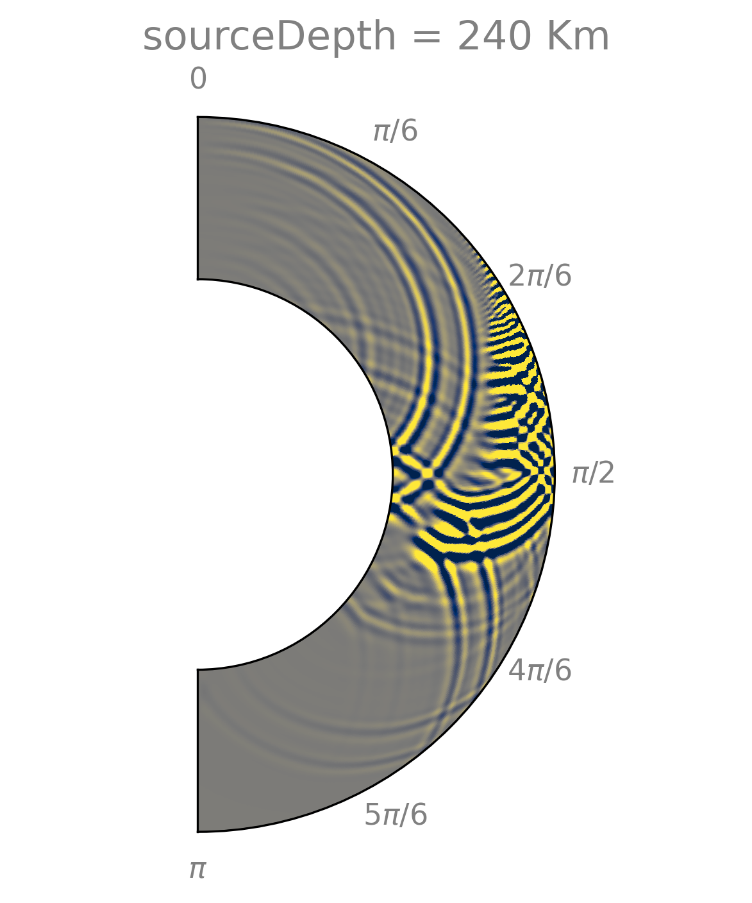
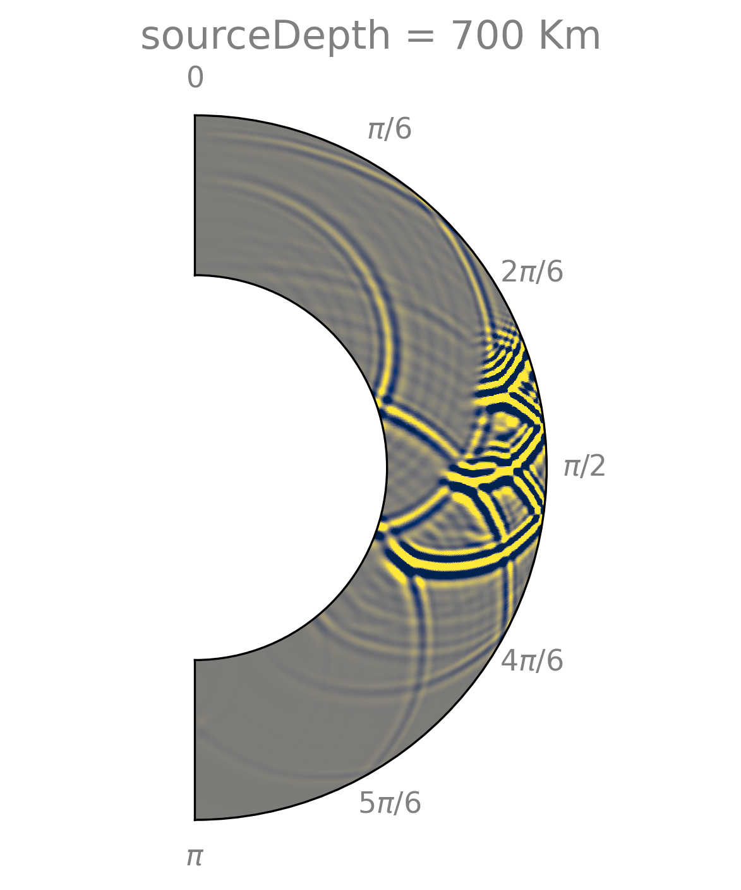

Demo 2
======

.. admonition:: Description:

   This demo simulates the wave dynamic for multiple
   forcings using the rank-1 formulation and the PREM Earth's model.

1. Prepare
----------

.. code-block:: bash

   export SHAWDIR=<fullpath-to-the-source-code-repository>
   export EXEDIR=<fullpath-to-where-you-built-the-code-executables>

   # create a dir to run the demo
   export MYRUNDIR=${HOME}/mySecondDemo
   mkdir -p ${MYRUNDIR}

.. Important::
   You need to have the code built to proceed, see :doc:`build_expert` or :doc:`build_stepbystep`.

|

2. Generate the mesh
--------------------

For this demo, we use a grid of ``256`` x ``1024`` velocity points
along the radial and polar directions, respectively.
To generate the mesh files proceed as follows:

.. code-block:: bash

   cd ${SHAWDIR}/meshing
   python create_single_mesh.py -nr 256 -nth 1024 -working-dir ${MYRUNDIR}

After generating the grid, you should have a ``${MYRUNDIR}/mesh256x1024`` directory containing:

.. code-block:: bash

   .
   ├── [5.9M]  coeff_vp.dat
   ├── [ 37M]  graph_sp.dat
   ├── [ 21M]  graph_vp.dat
   └── [ 231]  mesh_info.dat

|

3. Input file
-------------

We use the following input file (:doc:`learn more about input file <inputfile>`):

.. literalinclude :: ../../demos/demo2/input.yaml
  :language: yaml

which we have ready for you to copy as:

.. code-block:: bash

   cp ${SHAWDIR}/demos/demo2/input.yaml ${MYRUNDIR}

|

4. Run the simulation
---------------------

.. code-block:: bash

   cd ${MYRUNDIR}
   ln -s ${EXEDIR}/shawExe .

   # if you use OpenMP build, remember to set
   # OMP_NUM_THREADS=how-many-you-want-use OMP_PLACES=threads OMP_PROC_BIND=spread
   ./shawExe input.yaml

You will notice that since we use the rank-1 formulation, the code will solve
sequentially all four realizations of the forcing term.
To give an idea of runtime, on a MacPro with 2.4 GHz 8-Core Intel Core i9 and 32 GB 2667 MHz DDR4,
and using a serial build of the code, each individual realization takes approximately 36 seconds,
of which the IO time for data collection is less than 1 second.

5. Simulation data
------------------

After running the demo (have some patience because it takes some a couple minutes
if you use the serial mode), you should have inside ``${MYRUNDIR}`` the following files:

.. code-block:: bash

   coords_sp.txt #: coordinates of the velocity grid points
   coords_vp.txt #: coordinates of the stresses grid points

   seismogram_0  #: seismogram for depth = 240
   seismogram_1  #: seismogram for depth = 440
   seismogram_2  #: seismogram for depth = 540
   seismogram_3  #: seismogram for depth = 700

   snaps_vp_0    #: velocity snapshots for depth = 240
   snaps_vp_1    #: velocity snapshots for depth = 440
   snaps_vp_2    #: velocity snapshots for depth = 540
   snaps_vp_3    #: velocity snapshots for depth = 700

   snaps_sp_0    #: stresses snapshots for depth = 240
   snaps_sp_1    #: stresses snapshots for depth = 440
   snaps_sp_2    #: stresses snapshots for depth = 540
   snaps_sp_3    #: stresses snapshots for depth = 700

6. Post-process data
--------------------

To post-process the data, get the Python scripts created
for this demo and visualize the seismogram:

.. code-block:: bash

   cd ${MYRUNDIR}
   cp ${SHAWDIR}/demos/demo2/plotSeismogram.py .
   python plotSeismogram.py

We now extract and compare the velocity wavefield at ``t=2000`` (seconds)
for ``depth=240`` and ``depth=700``

.. code-block:: bash

   cd ${MYRUNDIR}
   ln -s ${EXEDIR}/extractStateFromSnaps .

   # snaps_vp_0 contains snapshots for depth=240 km
   # extract target state and write to file appending vp_d240 to identify the case
   ./extractStateFromSnaps --snaps=./snaps_vp_0 binary --fsize=1 \
     --outformat=ascii --timesteps=8000  --samplingfreq=100 --outfileappend=vp_d240

   # snaps_vp_3 contains snapshots for depth=700 km
   # extract target state and write to file appending vp_d700 to identify the case
   ./extractStateFromSnaps --snaps=./snaps_vp_3 binary --fsize=1 \
     --outformat=ascii --timesteps=8000  --samplingfreq=100 --outfileappend=vp_d700

   cp ${SHAWDIR}/demos/demo2/plotWavefield.py .
   python plotWavefield.py

And plot them below, showing as expected the largely different pattern
and trailing waves due to the complex reflection/refraction effects
of the waves propagating through the discontinuous PREM material model.

