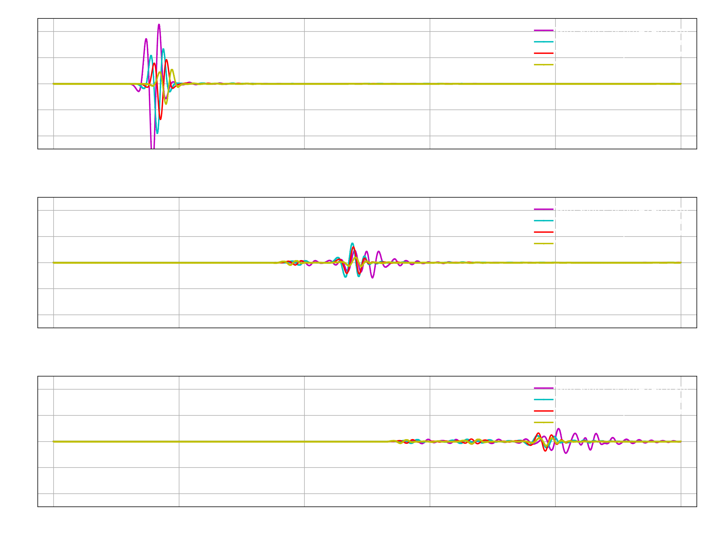

Demo 3
======

.. admonition:: Description:

   This demo simulates the wave dynamic for multiple
   forcings using the rank-2 formulation and the PREM Earth's model.
   For the sake of demonstration, this demo solves *the same problem*
   described in :doc:`demo2`, except that here we use the *rank-2 formulation*,
   which allows us to simulate several trajectories simultaneously.

1. Prepare
----------

.. code-block:: bash

   export SHAWDIR=<fullpath-to-the-source-code-repository>
   export EXEDIR=<fullpath-to-where-you-built-the-code-executables>

   # create a dir to run the demo
   export MYRUNDIR=${HOME}/myThirdDemo
   mkdir -p ${MYRUNDIR}

.. Important::
   You need to have the code built to proceed, see :doc:`build_expert` or :doc:`build_stepbystep`.

|

2. Generate the mesh
--------------------

.. code-block:: bash

   cd ${SHAWDIR}/meshing
   python create_single_mesh.py -nr 256 -nth 1024 -working-dir ${MYRUNDIR}

3. Input file
-------------

We use the following input file (:doc:`learn more about input file <inputfile>`):

.. literalinclude :: ../../demos/demo3/input.yaml
  :language: yaml

which we have ready for you to copy as:

.. code-block:: bash

   cp ${SHAWDIR}/demos/demo3/input.yaml ${MYRUNDIR}

|

4. Run the simulation
---------------------

.. code-block:: bash

   cd ${MYRUNDIR}
   ln -s ${EXEDIR}/shawExe .
   ./shawExe input.yaml

To give an idea of runtime, on a MacPro with 2.4 GHz 8-Core Intel Core i9 and 32 GB 2667 MHz DDR4,
and using a serial build of the code, the run takes approximately 107 seconds,
of which the IO time for data collection is less than 1 second.
Note that this already gives a hint to the advantages of using the rank-2 formulation.
In fact, while here it takes 107 seconds to simulate the four trajectories simultaneously,
in :doc:`rank-1 version of this demo <demo2>` it took
about 150 seconds to simulate the same realizations.

5. Simulation data
------------------

The demo should generate inside ``${MYRUNDIR}`` the following:

.. code-block:: bash

   coords_sp.txt #: coordinates of the velocity grid points
   coords_vp.txt #: oordinates of the stresses grid points

   # seismogram for all forcing realizations at the receiver locations
   # the input file set the format to be ascii
   # since we have 8 receivers and 4 sample depths, the file generated is as follows:
   # rows 1-8  : seismogram for each station when source depth=240 Km
   # rows 9-16 : seismogram for each station when source depth=440 Km
   # rows 17-24: seismogram for each station when source depth=540 Km
   # rows 25-32: seismogram for each station when source depth=700 Km
   seismogram_0

   snaps_vp_0    #: snapshot matrix for the velocity for all realizations
   snaps_sp_0    #: snapshot matrix for the stresses for all realizations

6. Post-process data
--------------------

To post-process the data, get the Python scripts created
for this demo and visualize the seismogram:

.. code-block:: bash

   cd ${MYRUNDIR}
   cp ${SHAWDIR}/demos/demo3/plotSeismogram.py .
   python plotSeismogram.py

Which generates a figure identical to the `seismogram plot obtained with the rank-1 <{filename}/rank1fommulti.rst>`_
(as expected) since here we solve the sample problem just in a different, more efficient way.

