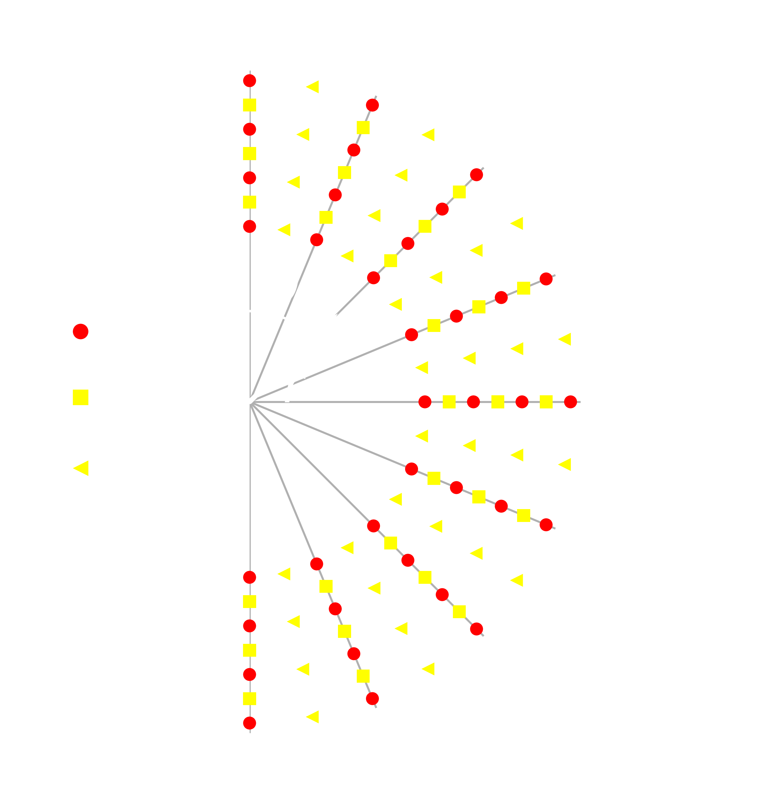

Governing equations
===================

This code simulates the evolution of elastic seismic shear waves in an axisymmetric domain.`

Assuming the target body/planet (e.g. Earth) can be approximated as a sphere,
we adopt a spherical coordinate system as shown in the figure below:

.. image:: ../img/sc.svg
  :width: 35 %
  :align: center
  :alt: Alternative text

In the axisymmetric approximation, one assumes that fields/quantities
do not vary along :math:`\phi`, implying that all the derivatives
with respect to :math:`\phi` can be dropped.

With this assumption, the set of equations governing the time evolution
of elastic waves in the velocity-stress formulation can be written as:

.. math::

	\rho \frac{\partial v}{\partial t} =
	\frac{\partial \sigma_{r\phi}}{\partial r}
	+ \frac{\partial \sigma_{\theta\phi}}{r \partial \theta}
	+ \frac{3}{r} \Big(\sigma_{r\phi}
	+ 2 \sigma_{\theta\phi} \cot{\theta} \Big) + f

.. math::

	\frac{\partial \sigma_{r\phi}}{\partial t} =
	G \left( \frac{\partial v}{\partial r} - \frac{1}{r} v \right)

.. math::

  \frac{\partial \sigma_{\theta\phi}}{\partial t} =
  G \left( \frac{1}{r} \frac{\partial v}{\partial \theta}
  - \frac{\cot{\theta}}{r} v \right)

where:

- :math:`t` represents time

- :math:`r \in [0, r_{surface}]` is the radial distance from origin to surface of the body

- :math:`\theta \in [0, \pi]` is the polar angle

- :math:`\rho(r, \theta)` is the density

- :math:`v(r, \theta, t)` is the velocity (for simplicity we drop the subscript, but it is intended to be the :math:`v_{\phi}` velocity component)

- :math:`\sigma_{r\phi}(r, \theta, t)` and :math:`\sigma_{\theta\phi}(r, \theta, t)` are the two components of the stress tensor remaining after the axisymmetric approximation

- :math:`f(r, \theta,t)` is the forcing term

- :math:`G(r, \theta) = v_s^2(r, \theta) \rho(r, \theta)` is the shear modulus and :math:`v_s` being the shear wave velocity.

In practice, the axisymmetric approximation means that one solves the
above governing equations over a *circular sector/block arc*.
Such a formulation is referred to as 2.5-dimensional because it involves
a 2-dimensional spatial domain (a circular sector of the Earth)
but models point sources with correct 3-dimensional spreading {cite}.

Note that we assume both the density and shear modulus to only depend on the spatial coordinates.

Discretization
==============

Shear waves cannot propagate in liquids.
Therefore, when modeling the Earth, the system of equations above is not
applicable to the core region of the Earth, and is solved in the region
bounded between the core-mantle boundary (CMB) located at :math:`r_{cmb} = 3,480` km
and the Earth surface located at :math:`r_{earth} = 6,371` km.
When modeling a body that is not the Earth, one needs to use proper domain bounds.
Note, however, that the code *always* assumes the domain NOT to include the
singularity at the origin, which yields substantial simplifications.

The 2D spatial domain is discretized using a staggered grid.
Staggered grids are typical for seismic modeling and wave problems in general.
We use a second-order centered finite-difference method for the spatial operators.
Directly at the symmetry axis, i.e., :math:`\theta = 0, \pi`, the velocity
is set to zero since it undefined here due to the cotangent term in its governing equation.
This implies that at the symmetry axis the stress :math:`\sigma_{r,\phi}` is also zero.
At the core-mantle boundary and earth surface we impose a free surface boundary
condition (i.e., waves fully reflect), by setting the zero-stress condition
:math:`\sigma_{r_{cmb},\phi} = \sigma_{r_{earth},\phi} = 0`.
Note that this condition on the stress directly defines the velocity
at the core-mantle boundary and earth surface and, therefore,
no boundary condition on the velocity itself must be set there.
We remark that, differently than (cite), we do not rely on ghost
points to impose boundary conditions, but account for the boundary
conditions directly when assembling the system matrix.

As an example, the figure below shows the grid when modeling the Earth: the computational
domain extends from the surface to the core-mantle boundary, excluding the liquid core.

	Schematic of the axi-symmetric domain for the Earth and staggered grid used for its discretization.
